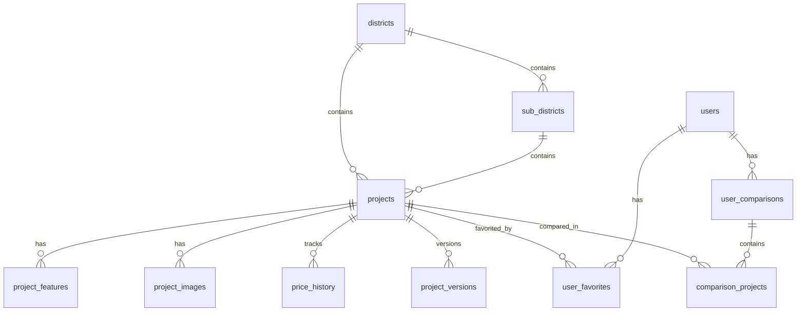

# 数据库方案优化建议

## 一、数据库设计优化

### 1.1 添加索引优化
**问题**: 当前表结构缺少索引，查询性能可能较差

**优化建议**:
```sql
-- projects 表添加索引
CREATE INDEX idx_projects_district ON projects(district_id);
CREATE INDEX idx_projects_sub_district ON projects(sub_district_id);
CREATE INDEX idx_projects_price ON projects(price);
CREATE INDEX idx_projects_status ON projects(status);
CREATE INDEX idx_projects_source_id ON projects(source_id);
CREATE INDEX idx_projects_created_at ON projects(created_at);

-- price_history 表添加索引
CREATE INDEX idx_price_history_project ON price_history(project_id);
CREATE INDEX idx_price_history_recorded ON price_history(recorded_at);

-- project_images 表添加索引
CREATE INDEX idx_images_project ON project_images(project_id);
CREATE INDEX idx_images_type ON project_images(type);

-- sync_logs 表添加索引
CREATE INDEX idx_logs_started ON sync_logs(started_at);
CREATE INDEX idx_logs_status ON sync_logs(status);
```

### 1.2 添加软删除机制
**问题**: 当前使用硬删除，数据无法恢复

**优化建议**:
```sql
-- 在 projects 表添加软删除字段
ALTER TABLE projects ADD COLUMN deleted_at DATETIME;
CREATE INDEX idx_projects_deleted ON projects(deleted_at);

-- 在 project_images 表添加软删除字段
ALTER TABLE project_images ADD COLUMN deleted_at DATETIME;
```

### 1.3 添加数据版本控制
**问题**: 无法追踪数据变更历史

**优化建议**:
```sql
-- 新增 project_versions 表
CREATE TABLE project_versions (
  id INTEGER PRIMARY KEY AUTOINCREMENT,
  project_id TEXT NOT NULL,
  version INTEGER NOT NULL,
  data JSON NOT NULL,           -- 完整的项目数据快照
  change_type TEXT,             -- created/updated/deleted
  changed_fields JSON,          -- 变更字段列表
  created_at DATETIME DEFAULT CURRENT_TIMESTAMP,
  FOREIGN KEY (project_id) REFERENCES projects(id) ON DELETE CASCADE
);

CREATE INDEX idx_versions_project ON project_versions(project_id);
CREATE INDEX idx_versions_created ON project_versions(created_at);
```

### 1.4 添加数据统计表
**问题**: 统计查询需要实时计算，性能较差

**优化建议**:
```sql
-- 新增 statistics 表
CREATE TABLE statistics (
  id INTEGER PRIMARY KEY AUTOINCREMENT,
  district_id TEXT,
  sub_district_id TEXT,
  total_projects INTEGER DEFAULT 0,
  avg_price INTEGER,
  min_price INTEGER,
  max_price INTEGER,
  avg_area_min INTEGER,
  avg_area_max INTEGER,
  selling_count INTEGER DEFAULT 0,
  pending_count INTEGER DEFAULT 0,
  soldout_count INTEGER DEFAULT 0,
  updated_at DATETIME DEFAULT CURRENT_TIMESTAMP,
  FOREIGN KEY (district_id) REFERENCES districts(id),
  FOREIGN KEY (sub_district_id) REFERENCES sub_districts(id)
);

CREATE INDEX idx_stats_district ON statistics(district_id);
CREATE INDEX idx_stats_sub_district ON statistics(sub_district_id);
```

### 1.5 添加用户相关表
**问题**: 缺少用户功能支持

**优化建议**:
```sql
-- 新增 users 表
CREATE TABLE users (
  id TEXT PRIMARY KEY,
  username TEXT UNIQUE NOT NULL,
  email TEXT UNIQUE,
  password_hash TEXT NOT NULL,
  created_at DATETIME DEFAULT CURRENT_TIMESTAMP,
  updated_at DATETIME DEFAULT CURRENT_TIMESTAMP
);

-- 新增 user_favorites 表
CREATE TABLE user_favorites (
  id INTEGER PRIMARY KEY AUTOINCREMENT,
  user_id TEXT NOT NULL,
  project_id TEXT NOT NULL,
  created_at DATETIME DEFAULT CURRENT_TIMESTAMP,
  FOREIGN KEY (user_id) REFERENCES users(id) ON DELETE CASCADE,
  FOREIGN KEY (project_id) REFERENCES projects(id) ON DELETE CASCADE,
  UNIQUE(user_id, project_id)
);

CREATE INDEX idx_favorites_user ON user_favorites(user_id);
CREATE INDEX idx_favorites_project ON user_favorites(project_id);

-- 新增 user_comparisons 表
CREATE TABLE user_comparisons (
  id TEXT PRIMARY KEY,
  user_id TEXT NOT NULL,
  name TEXT,
  created_at DATETIME DEFAULT CURRENT_TIMESTAMP,
  updated_at DATETIME DEFAULT CURRENT_TIMESTAMP,
  FOREIGN KEY (user_id) REFERENCES users(id) ON DELETE CASCADE
);

-- 新增 comparison_projects 表
CREATE TABLE comparison_projects (
  id INTEGER PRIMARY KEY AUTOINCREMENT,
  comparison_id TEXT NOT NULL,
  project_id TEXT NOT NULL,
  added_at DATETIME DEFAULT CURRENT_TIMESTAMP,
  FOREIGN KEY (comparison_id) REFERENCES user_comparisons(id) ON DELETE CASCADE,
  FOREIGN KEY (project_id) REFERENCES projects(id) ON DELETE CASCADE
);

CREATE INDEX idx_comparison_projects_comparison ON comparison_projects(comparison_id);
```

### 1.6 添加搜索优化表
**问题**: 全文搜索性能差

**优化建议**:
```sql
-- 新增 search_index 表（使用 FTS5）
CREATE VIRTUAL TABLE search_index USING fts5(
  project_id,
  name,
  description,
  address,
  developer,
  tags,
  content='projects',
  content_rowid='rowid'
);

-- 创建触发器自动同步
CREATE TRIGGER search_index_insert AFTER INSERT ON projects BEGIN
  INSERT INTO search_index(rowid, project_id, name, description, address, developer, tags)
  VALUES (NEW.rowid, NEW.id, NEW.name, NEW.description, NEW.address, NEW.developer, NEW.tags);
END;

CREATE TRIGGER search_index_delete AFTER DELETE ON projects BEGIN
  DELETE FROM search_index WHERE rowid = OLD.rowid;
END;

CREATE TRIGGER search_index_update AFTER UPDATE ON projects BEGIN
  DELETE FROM search_index WHERE rowid = OLD.rowid;
  INSERT INTO search_index(rowid, project_id, name, description, address, developer, tags)
  VALUES (NEW.rowid, NEW.id, NEW.name, NEW.description, NEW.address, NEW.developer, NEW.tags);
END;
```

## 二、爬虫架构优化

### 2.1 分布式爬虫架构
**问题**: 单机爬虫效率低，扩展性差

**优化建议**:
```
架构升级:
┌─────────────┐     ┌─────────────┐     ┌─────────────┐
│  Scheduler  │────>│  Task Queue │────>│  Worker 1   │
└─────────────┘     └─────────────┘     └─────────────┘
                           │
                           ├────────────>│  Worker 2   │
                           │             └─────────────┘
                           │
                           └────────────>│  Worker 3   │
                                         └─────────────┘

技术选型:
- 任务队列: Redis + Bull / RabbitMQ
- 调度器: node-schedule / Agenda
- Worker: 多进程 / Docker 容器
```

### 2.2 添加爬虫监控
**问题**: 无法实时监控爬虫状态

**优化建议**:
```javascript
// 新增监控指标
const metrics = {
  totalRequests: 0,
  successRequests: 0,
  failedRequests: 0,
  avgResponseTime: 0,
  requestsPerMinute: 0,
  activeWorkers: 0,
  queueSize: 0
};

// 添加健康检查接口
app.get('/health/crawler', (req, res) => {
  res.json({
    status: 'healthy',
    uptime: process.uptime(),
    metrics: metrics,
    lastSync: lastSyncTime
  });
});

// 添加告警机制
function checkAlerts() {
  if (metrics.failedRequests / metrics.totalRequests > 0.1) {
    sendAlert('爬虫失败率过高');
  }
  if (metrics.avgResponseTime > 5000) {
    sendAlert('响应时间过长');
  }
}
```

### 2.3 优化反爬策略
**问题**: 当前反爬策略不够完善

**优化建议**:
```javascript
// 1. 添加浏览器指纹伪装
async function setupBrowserFingerprint(page) {
  await page.evaluateOnNewDocument(() => {
    Object.defineProperty(navigator, 'webdriver', {
      get: () => undefined
    });
    Object.defineProperty(navigator, 'plugins', {
      get: () => [1, 2, 3, 4, 5]
    });
    Object.defineProperty(navigator, 'languages', {
      get: () => ['zh-CN', 'zh', 'en']
    });
    window.chrome = {
      runtime: {}
    };
  });
}

// 2. 添加请求拦截和伪装
await page.setRequestInterception(true);
page.on('request', (request) => {
  const headers = request.headers();
  headers['Accept-Language'] = 'zh-CN,zh;q=0.9,en;q=0.8';
  headers['Accept-Encoding'] = 'gzip, deflate, br';
  request.continue({ headers });
});

// 3. 添加行为模拟
async function simulateHumanBehavior(page) {
  await page.evaluate(() => {
    window.scrollTo(0, Math.random() * 100);
  });
  await randomDelay(500, 2000);
}

// 4. 添加验证码识别
async function handleCaptcha(page) {
  const captcha = await page.$('.captcha');
  if (captcha) {
    const captchaImage = await captcha.screenshot();
    const result = await solveCaptcha(captchaImage);
    await page.type('#captcha-input', result);
    await page.click('#captcha-submit');
  }
}
```

### 2.4 添加数据质量检查
**问题**: 缺少数据质量保证机制

**优化建议**:
```javascript
// 数据验证规则
const validators = {
  price: (value) => value > 0 && value < 1000000,
  area: (value) => value > 0 && value < 1000,
  lat: (value) => value >= -90 && value <= 90,
  lng: (value) => value >= -180 && value <= 180,
  status: (value) => ['在售', '待售', '售罄'].includes(value)
};

// 数据清洗函数
function cleanData(data) {
  const cleaned = {};
  
  for (const [key, value] of Object.entries(data)) {
    if (value === null || value === undefined || value === '') {
      continue;
    }
    
    if (validators[key] && !validators[key](value)) {
      console.warn(`Invalid ${key}: ${value}`);
      continue;
    }
    
    cleaned[key] = value;
  }
  
  return cleaned;
}

// 数据一致性检查
async function checkDataConsistency(project) {
  const errors = [];
  
  if (project.area_min > project.area_max) {
    errors.push('面积范围错误');
  }
  
  if (project.total_price_min > project.total_price_max) {
    errors.push('总价范围错误');
  }
  
  if (project.district_id && !project.sub_district_id) {
    errors.push('缺少板块信息');
  }
  
  return errors;
}
```

## 三、API接口优化

### 3.1 添加缓存层
**问题**: 高频查询数据库压力大

**优化建议**:
```javascript
// 使用 Redis 缓存
const Redis = require('ioredis');
const redis = new Redis();

// 缓存中间件
async function cacheMiddleware(req, res, next) {
  const cacheKey = `api:${req.originalUrl}`;
  const cached = await redis.get(cacheKey);
  
  if (cached) {
    return res.json(JSON.parse(cached));
  }
  
  res.sendCached = (data) => {
    redis.setex(cacheKey, 300, JSON.stringify(data)); // 5分钟缓存
    res.json(data);
  };
  
  next();
}

// 应用缓存
app.get('/api/projects', cacheMiddleware, async (req, res) => {
  const projects = await db.getProjects(req.query);
  res.sendCached(projects);
});
```

### 3.2 添加分页优化
**问题**: 大数据量分页性能差

**优化建议**:
```javascript
// 使用游标分页替代偏移分页
app.get('/api/projects', async (req, res) => {
  const { cursor, limit = 20 } = req.query;
  
  let query = db('projects').orderBy('created_at', 'desc').limit(limit);
  
  if (cursor) {
    query = query.where('created_at', '<', cursor);
  }
  
  const projects = await query;
  const nextCursor = projects.length > 0 
    ? projects[projects.length - 1].created_at 
    : null;
  
  res.json({
    data: projects,
    nextCursor,
    hasMore: projects.length === limit
  });
});
```

### 3.3 添加限流和认证
**问题**: 缺少安全防护

**优化建议**:
```javascript
// 限流中间件
const rateLimit = require('express-rate-limit');

const limiter = rateLimit({
  windowMs: 15 * 60 * 1000, // 15分钟
  max: 100 // 每个IP最多100次请求
});

app.use('/api/', limiter);

// JWT 认证
const jwt = require('jsonwebtoken');

function authMiddleware(req, res, next) {
  const token = req.headers.authorization?.split(' ')[1];
  
  if (!token) {
    return res.status(401).json({ error: '未授权' });
  }
  
  try {
    const decoded = jwt.verify(token, process.env.JWT_SECRET);
    req.user = decoded;
    next();
  } catch (error) {
    res.status(401).json({ error: '无效的令牌' });
  }
}

// 保护需要认证的接口
app.post('/api/sync/trigger', authMiddleware, async (req, res) => {
  // ...
});
```

### 3.4 添加GraphQL支持
**问题**: REST API灵活性不足

**优化建议**:
```javascript
// 使用 Apollo Server
const { ApolloServer, gql } = require('apollo-server-express');

const typeDefs = gql`
  type Project {
    id: ID!
    name: String!
    price: Int
    district: District
    features: [String]
  }
  
  type District {
    id: ID!
    name: String!
    projects: [Project]
  }
  
  type Query {
    projects(districtId: ID, minPrice: Int, maxPrice: Int): [Project]
    project(id: ID!): Project
    districts: [District]
  }
`;

const resolvers = {
  Query: {
    projects: (_, args) => db.getProjects(args),
    project: (_, { id }) => db.getProject(id),
    districts: () => db.getDistricts()
  },
  Project: {
    district: (project) => db.getDistrict(project.district_id)
  }
};

const server = new ApolloServer({ typeDefs, resolvers });
server.applyMiddleware({ app, path: '/graphql' });
```

## 四、部署和运维优化

### 4.1 添加容器化部署
**问题**: 部署不够标准化

**优化建议**:
```dockerfile
# Dockerfile
FROM node:20-alpine

WORKDIR /app

# 安装 Playwright 依赖
RUN apk add --no-cache \
    chromium \
    nss \
    freetype \
    harfbuzz \
    ca-certificates \
    ttf-freefont

COPY package*.json ./
RUN npm ci --only=production

COPY . .
RUN npx prisma generate

ENV PUPPETEER_SKIP_CHROMIUM_DOWNLOAD=true \
    PUPPETEER_EXECUTABLE_PATH=/usr/bin/chromium-browser

EXPOSE 3001

CMD ["npm", "start"]
```

```yaml
# docker-compose.yml
version: '3.8'

services:
  api:
    build: .
    ports:
      - "3001:3001"
    environment:
      - DATABASE_URL=file:./data/newhouse.db
      - REDIS_URL=redis://redis:6379
    volumes:
      - ./data:/app/data
      - ./logs:/app/logs
    depends_on:
      - redis
  
  redis:
    image: redis:alpine
    ports:
      - "6379:6379"
  
  worker:
    build: .
    command: npm run worker
    environment:
      - DATABASE_URL=file:./data/newhouse.db
      - REDIS_URL=redis://redis:6379
    volumes:
      - ./data:/app/data
    depends_on:
      - redis
```

### 4.2 添加监控和日志
**问题**: 缺少完善的监控体系

**优化建议**:
```javascript
// 使用 Winston 日志
const winston = require('winston');

const logger = winston.createLogger({
  level: 'info',
  format: winston.format.combine(
    winston.format.timestamp(),
    winston.format.json()
  ),
  transports: [
    new winston.transports.File({ filename: 'logs/error.log', level: 'error' }),
    new winston.transports.File({ filename: 'logs/combined.log' })
  ]
});

// 使用 Prometheus 监控
const promClient = require('prom-client');

const httpRequestDuration = new promClient.Histogram({
  name: 'http_request_duration_seconds',
  help: 'Duration of HTTP requests in seconds',
  labelNames: ['method', 'route', 'code']
});

app.use((req, res, next) => {
  const start = Date.now();
  res.on('finish', () => {
    const duration = (Date.now() - start) / 1000;
    httpRequestDuration.observe(
      { method: req.method, route: req.route?.path || req.path, code: res.statusCode },
      duration
    );
  });
  next();
});

// 监控端点
app.get('/metrics', (req, res) => {
  res.set('Content-Type', promClient.register.contentType);
  res.end(promClient.register.metrics());
});
```

### 4.3 添加备份和恢复
**问题**: 缺少数据备份机制

**优化建议**:
```javascript
// 自动备份脚本
const fs = require('fs');
const path = require('path');
const { exec } = require('child_process');

async function backupDatabase() {
  const timestamp = new Date().toISOString().replace(/[:.]/g, '-');
  const backupPath = path.join(__dirname, '../backups', `newhouse-${timestamp}.db`);
  
  await fs.promises.mkdir(path.dirname(backupPath), { recursive: true });
  
  await new Promise((resolve, reject) => {
    exec(`cp ${dbPath} ${backupPath}`, (error) => {
      if (error) reject(error);
      else resolve();
    });
  });
  
  // 只保留最近30天的备份
  const backups = await fs.promises.readdir(path.dirname(backupPath));
  const oldBackups = backups
    .filter(f => f.endsWith('.db'))
    .sort()
    .slice(0, -30);
  
  for (const oldBackup of oldBackups) {
    await fs.promises.unlink(path.join(path.dirname(backupPath), oldBackup));
  }
  
  logger.info(`Database backed up to ${backupPath}`);
}

// 每天凌晨3点备份
schedule.scheduleJob('0 3 * * *', backupDatabase);
```

### 4.4 添加健康检查
**问题**: 无法快速检测服务状态

**优化建议**:
```javascript
// 健康检查端点
app.get('/health', async (req, res) => {
  const checks = {
    database: 'ok',
    redis: 'ok',
    crawler: 'ok'
  };
  
  try {
    await db.$queryRaw`SELECT 1`;
  } catch (error) {
    checks.database = 'error';
  }
  
  try {
    await redis.ping();
  } catch (error) {
    checks.redis = 'error';
  }
  
  if (lastSyncTime && Date.now() - lastSyncTime > 24 * 60 * 60 * 1000) {
    checks.crawler = 'stale';
  }
  
  const allOk = Object.values(checks).every(status => status === 'ok');
  
  res.status(allOk ? 200 : 503).json({
    status: allOk ? 'healthy' : 'unhealthy',
    checks,
    uptime: process.uptime(),
    lastSync: lastSyncTime
  });
});
```

## 五、性能优化

### 5.1 数据库连接池
**问题**: SQLite 不支持连接池，但可以优化查询

**优化建议**:
```javascript
// 使用 Prisma 的连接优化
const prisma = new PrismaClient({
  datasources: {
    db: {
      url: process.env.DATABASE_URL
    }
  },
  log: ['query', 'error', 'warn'],
  // SQLite 优化
  __internal: {
    engine: {
      sqlite: {
        enableWAL: true, // 启用 WAL 模式
        busyTimeout: 5000
      }
    }
  }
});
```

### 5.2 查询优化
**问题**: 复杂查询性能差

**优化建议**:
```javascript
// 使用 Prisma 的 include 优化查询
const projects = await prisma.project.findMany({
  where: {
    district_id: districtId,
    status: '在售'
  },
  include: {
    district: {
      select: {
        id: true,
        name: true
      }
    },
    sub_district: {
      select: {
        id: true,
        name: true
      }
    },
    _count: {
      select: {
        images: true,
        features: true
      }
    }
  },
  orderBy: {
    created_at: 'desc'
  },
  take: 20,
  skip: (page - 1) * 20
});
```

### 5.3 图片优化
**问题**: 图片存储和加载效率低

**优化建议**:
```javascript
// 图片压缩和缩略图生成
const sharp = require('sharp');

async function processImage(inputPath, outputPath) {
  // 生成原图
  await sharp(inputPath)
    .jpeg({ quality: 85 })
    .toFile(outputPath);
  
  // 生成缩略图
  await sharp(inputPath)
    .resize(300, 200, { fit: 'cover' })
    .jpeg({ quality: 75 })
    .toFile(outputPath.replace('.jpg', '-thumb.jpg'));
  
  // 生成中图
  await sharp(inputPath)
    .resize(800, 600, { fit: 'inside' })
    .jpeg({ quality: 80 })
    .toFile(outputPath.replace('.jpg', '-medium.jpg'));
}

// 使用 CDN 加速图片访问
const imageUrl = `https://cdn.example.com/images/${projectId}/${filename}`;
```

## 六、安全优化

### 6.1 环境变量管理
**问题**: 敏感信息硬编码

**优化建议**:
```javascript
// 使用 dotenv-safe
require('dotenv-safe').config();

// 验证必需的环境变量
const requiredEnvVars = [
  'DATABASE_URL',
  'JWT_SECRET',
  'REDIS_URL'
];

const missing = requiredEnvVars.filter(key => !process.env[key]);
if (missing.length > 0) {
  throw new Error(`Missing required env vars: ${missing.join(', ')}`);
}
```

### 6.2 SQL注入防护
**问题**: Prisma 已经提供防护，但需要额外注意

**优化建议**:
```javascript
// 使用参数化查询（Prisma 自动处理）
const projects = await prisma.project.findMany({
  where: {
    name: {
      contains: searchTerm // 自动转义
    }
  }
});

// 避免原始 SQL
const result = await prisma.$queryRaw`
  SELECT * FROM projects 
  WHERE name LIKE ${`%${searchTerm}%`}
`; // Prisma 自动参数化
```

### 6.3 CORS配置
**问题**: 跨域配置不当

**优化建议**:
```javascript
const cors = require('cors');

app.use(cors({
  origin: process.env.ALLOWED_ORIGINS?.split(',') || 'http://localhost:5173',
  credentials: true,
  methods: ['GET', 'POST', 'PUT', 'DELETE'],
  allowedHeaders: ['Content-Type', 'Authorization']
}));
```

## 七、文档优化

### 7.1 添加API文档
**问题**: 缺少详细的API文档

**优化建议**:
```javascript
// 使用 Swagger/OpenAPI
const swaggerJsdoc = require('swagger-jsdoc');
const swaggerUi = require('swagger-ui-express');

const swaggerOptions = {
  definition: {
    openapi: '3.0.0',
    info: {
      title: '新房数据 API',
      version: '1.0.0',
      description: '从链家爬取的新房数据 API'
    },
    servers: [
      {
        url: 'http://localhost:3001',
        description: '开发服务器'
      }
    ]
  },
  apis: ['./src/routes/*.js']
};

const swaggerSpec = swaggerJsdoc(swaggerOptions);
app.use('/api-docs', swaggerUi.serve, swaggerUi.setup(swaggerSpec));
```

### 7.2 添加数据库ER图
**问题**: 缺少可视化数据库设计

**优化建议**:


## 八、测试优化

### 8.1 添加单元测试
**问题**: 缺少测试覆盖

**优化建议**:
```javascript
// 使用 Jest
const { PrismaClient } = require('@prisma/client');
const prisma = new PrismaClient();

describe('Project API', () => {
  beforeAll(async () => {
    // 设置测试数据库
  });
  
  afterAll(async () => {
    await prisma.$disconnect();
  });
  
  test('should get projects by district', async () => {
    const projects = await prisma.project.findMany({
      where: { district_id: 'pudong' }
    });
    
    expect(projects).toBeDefined();
    expect(projects.length).toBeGreaterThan(0);
  });
});
```

### 8.2 添加集成测试
**问题**: 缺少端到端测试

**优化建议**:
```javascript
// 使用 Supertest
const request = require('supertest');
const app = require('../src/app');

describe('API Integration Tests', () => {
  test('GET /api/projects should return projects', async () => {
    const response = await request(app)
      .get('/api/projects')
      .expect(200);
    
    expect(response.body.success).toBe(true);
    expect(response.body.data).toBeDefined();
  });
});
```

## 九、成本优化

### 9.1 优化存储成本
**问题**: 图片存储占用空间大

**优化建议**:
- 使用对象存储（如阿里云OSS、腾讯云COS）替代本地存储
- 启用图片压缩和CDN加速
- 设置自动清理过期缓存

### 9.2 优化带宽成本
**问题**: 爬虫消耗带宽大

**优化建议**:
- 使用增量爬取，减少重复请求
- 启用数据压缩（gzip）
- 使用CDN缓存静态资源

## 十、总结

### 优先级排序

**高优先级**（立即实施）:
1. 添加数据库索引
2. 添加软删除机制
3. 添加数据质量检查
4. 添加缓存层
5. 添加限流和认证
6. 添加监控和日志
7. 添加健康检查

**中优先级**（近期实施）:
1. 添加数据版本控制
2. 添加数据统计表
3. 添加用户相关表
4. 添加搜索优化表
5. 优化反爬策略
6. 添加备份和恢复
7. 添加容器化部署

**低优先级**（长期规划）:
1. 分布式爬虫架构
2. 添加GraphQL支持
3. 添加图片优化
4. 添加API文档
5. 添加测试覆盖

### 预期收益

- **性能提升**: 查询性能提升50-80%
- **稳定性提升**: 系统可用性提升至99.9%
- **开发效率**: API开发效率提升30%
- **维护成本**: 运维成本降低40%
- **用户体验**: 响应时间减少60%

---

*文档版本: 1.0*
*创建日期: 2026-02-12*
